So I wanted to be able to share my blog with social sites ie.. twitter, linkdin etc.. and had a quick search via google and found some great sites that really helped put the bits of the puzzle together so shout outs to 

([Sysid](https://sysid.github.io/social_share/)) and ([CodewithLinda](https://www.codewithlinda.com/blog/social-share-buttons-with-react-share/))

So below is my method of getting Social Buttons into my little blog.

You will need the folling plugins before starting,

npm install react-share - - save
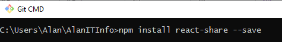

and

npm install sass gatsby-plugin-sass - -save
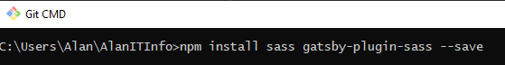

(Include the plugin in your gatsby-config.js file as gatsby-plugin-sass)
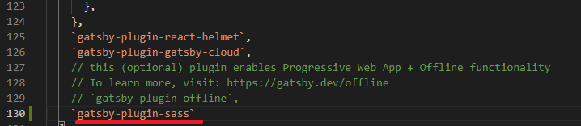

Open gatsby-config.js and update the site metadata with your sites information
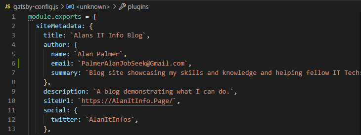

Next head over to src/templates/blog-post.js to add some information to the pagequery area, 
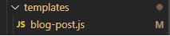

In the siteMetadata you will need to add "site Url" and "social" and the "tags" need adding to "frontmatter" just under "description" (see screenshot below) 
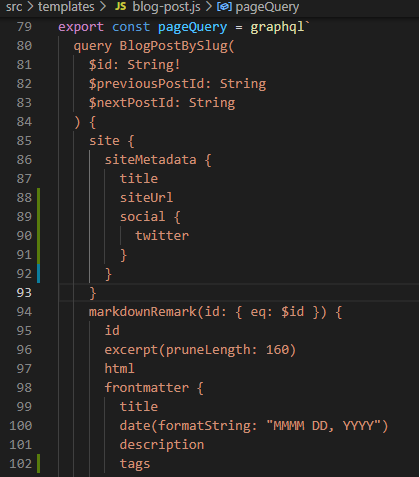

Now go to your components folder in src, create a new folder named ShareButtons and inside it create a sharebuttons.js file
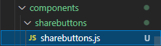

Populate sharebuttons.js with the following information below.

    import React from 'react'
    import PropTypes from "prop-types"

    import {
    FacebookShareButton,
    FacebookIcon,
    LinkedinShareButton,
    LinkedinIcon,
    TwitterShareButton,
    TwitterIcon,
    WhatsappShareButton,
    WhatsappIcon,
    RedditShareButton,
    RedditIcon
        } from 'react-share'

    const Share = ({ socialConfig, tags }) => (
    

      <FacebookShareButton url={socialConfig.config.url} quote={socialConfig.config.title} hashtag={[]}>
        <FacebookIcon size={45} round={true}/>
      </FacebookShareButton>

      <TwitterShareButton url={socialConfig.config.url} title={socialConfig.config.title} via={socialConfig.twitter} hashtags={[]}>
                <TwitterIcon  size={45} round={true} />
          </TwitterShareButton>

         <LinkedinShareButton url={socialConfig.config.url} >
            <LinkedinIcon  size={45} round={true}/>
          </LinkedinShareButton>

          <RedditShareButton url={socialConfig.config.url} title={socialConfig.config.title} >
            <RedditIcon  size={45} round={true} />
          </RedditShareButton>

          <WhatsappShareButton url={socialConfig.config.url} title={socialConfig.config.title}>
               <WhatsappIcon  size={45} round={true}/>
           </WhatsappShareButton>
      ...
    

     )

    Share.propTypes = {
     socialConfig: PropTypes.shape({
     twitter: PropTypes.string.isRequired,
     config: PropTypes.shape({
      url: PropTypes.string.isRequired,
      title: PropTypes.string.isRequired,
      }),
    }).isRequired,
    tags: PropTypes.arrayOf(PropTypes.string),
      }
     Share.defaultProps = {
     tags: [],
      }

      export default Share

This will create your share buttons and populated it the information you provided in the sitemeta data and your blog posts.

Next head over to src/templates/blog-post.js to add the sharebuttons in to your blogs

You will need to import the sharebutton.js into the blog-post.js so you can call it.

<strong> import Share from "../components/sharebuttons/sharebuttons" </Strong>

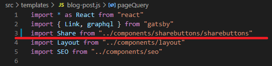

Now we add the the twitter connector and the Url Connector in blog-post.js

<strong> const twitter = data.site.siteMetadata.social.twitter </strong>

<strong> const url = data.site.siteMetadata.siteUrl </strong>

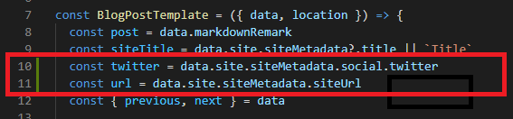

Now we add the share section which will display the social connections for us. (I have place mine the footer sction of blog-post.js feel free to place any where you want)

          <Share
            socialConfig={{
              twitter,
              config: {
                url: `${url}${post.frontmatter.slug}`,
                title: post.frontmatter.title,
              },
            }}
            tags={post.frontmatter.tags}
          />

My share section within the footer section of blog-post.js

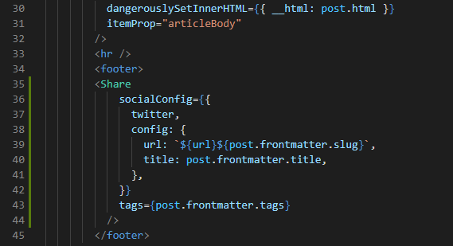

You will to restat gatsby to see the changes and the icons on all your blog posts.

However you will notice that all the social tags are all bunched up toghter, what we can do is apply a little margin between the icons by doing the following

Go back to your components folder in src a create sharebuttonsstyle.scss file
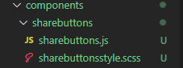

In the sharebuttonsstyle.scss file add the following and save

    .react-share__ShareButton{
    margin-right: 1rem;

       & a svg{
          &:hover{
             rect{
                fill: var(--link-color) !important;
            }
        }
    }}

We now need import the sharebuttonsstyle.scss file into the sharebuttons.js file.

Open the sharebuttons.js file and add the following line.

<strong> import "./sharebuttonsstyle.scss" </strong>

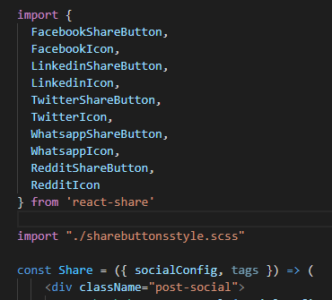

Restart your Gatsby Session and when you check your blog you should see the social icons spaced further apart.

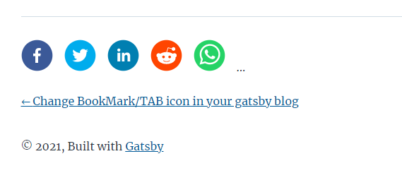