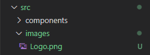
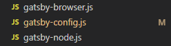
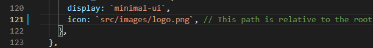
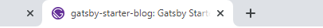
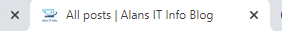

Working with the gatsby-starter-blog and one of the first things most people change is the profile picture from the dashing Mark Matthews but I also wanted to change BookMark/TAB Icon from the gatsby logo to my logo.

Gatsby Logo 

My Logo

Method 1.

Change the gatsby-icon.png in /src/Images to your own image.

Method 2.

Add you own image to the images folder 

Then find the gatsby-config.js file

Look for Line 121 and change gatsby-icon.png to your image ie.. logo.png

End Result

Hopefully if all has gone to plan, then your tab icon should change from this.

To the one you want ie.. my logo. 

