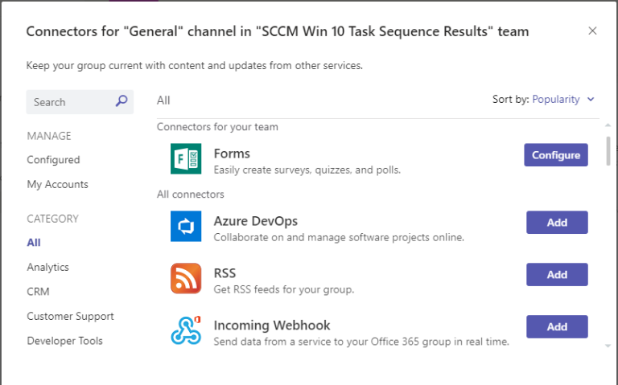

1. Select the channel you what the connector to be attached to and click on the “…” menu and select “Connectors”

Channel with connectors showing after clicking on “…”
2. This will display the connector options available for the channel, select the connector required “incoming webhook” and click the “add” button.

3. This will open the further information on the connector click the “add” button

4. You should now see the configuration options for the Connector, Enter for the incoming webhook ie.. SCCM_Task_Teams and click “create”, you can also add your own Icon if you want to to identify them in teams.

5. After a few seconds the the “Create and Cancel” boxes will be replaced by a URL, remember to copy this to a safe location and click “Done”

6. If all successful you should now see when you check connections in the channel, Incoming WebHooks should now show in “configured” under “MANAGE”.

