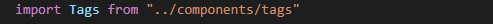
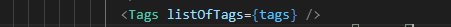
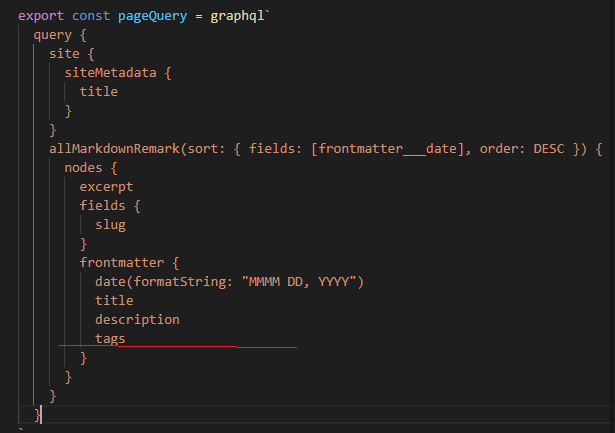
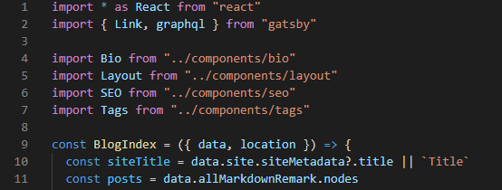
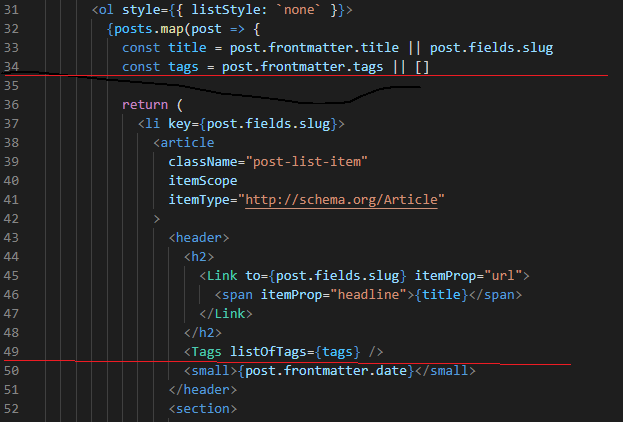
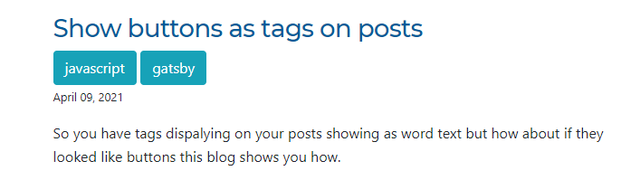

So this is a quick way of adding blog tags on the landing page which is built on a previous post "Displaying tags on posts"

So for this we need three lines of code,

We then need to head over to our stc/pages/index.js and put the following code into it.

Our first thing we need to do is update the pagequery section with tags.

We now need to add the import tags commond to the top of the index.js

Add the const tags and the list of tags to your index.js

At the end of the process you should now see tags next to your blog posts on the landing page.

