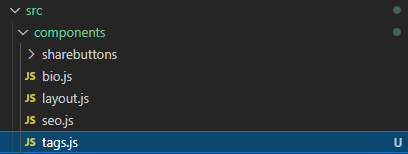
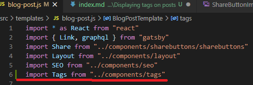
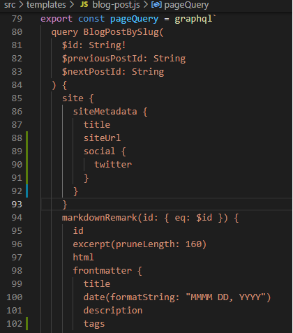
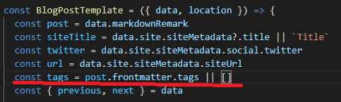
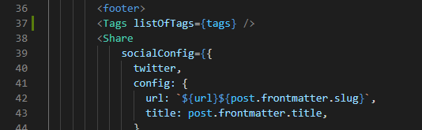
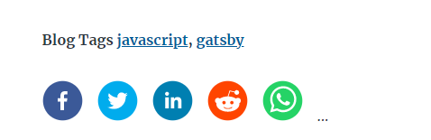

So one of the major things parts of my Gatsby blog is to get Tags displaying on blog pots after some searching via google I found some great sites that really helped so shout outs to 

([Tarascodes](https://tarascodes.com/create-tags-component/)) and ([casperlehmann.com](https://casperlehmann.com/setting-up-tags-for-gatsby-pages//))

To start we need to create a tags component to handle the tags sorting and classification and style before sending back.

Click on "compoents" and right click "new" and name it "tags.js"

In this blank file put the following code in.

    import React from "react"
    import { Link } from "gatsby"

    import kebabCase from "lodash/kebabCase"

    const Tags = props => {
    // If the current post does not have any tags then stop rendering the component.
     if (!props.listOfTags.length) {
    return null
    }

    // Display a list of tags for the current blog post.
     return (
    

    <strong>
     Blog Tags {props.listOfTags.map((tag, i) => [
    i > 0 && ", ",
    <Link to={`/tags/${kebabCase(tag)}/`} >
    {tag}
    </Link>
    ])}
    </strong>
    

     )
    }

    export default Tags

Now we need to call it within src/templates/blog-post.js for it to work,

add the following to src/templates/blog-post.js import Tags from "../components/tags"

Also within the blog-post.js we also need to add "tags" into the Markdown data

Now we have added the Markdown data we now need to call it with the following command "const tags = post.frontmatter.tags || []"

Finally we can now add the following command to call the tags "<Tags listOfTags={tags} />" 

And your blog should now start showing your blog tags

