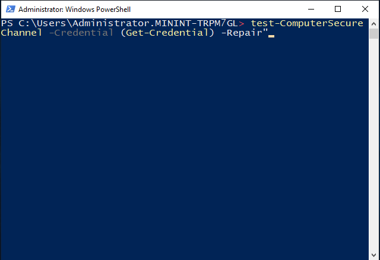
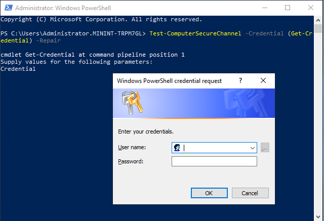
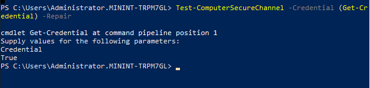

Working with a customer and handful of there devices which had been powered off for a bit displayed the following information when a user attempted to logon.

“The trust relationship between this workstation and the primary domain failed.”

If you happen to know the local admin password and/or have it enabled on the device then you can use the following powershell command.

“Test-ComputerSecureChannel -Credential (Get-Credential) -Repair”

(There will be a pop up a dialog asking for your domain credentials.) (The account you use also needs the “Rest Password” rights)

And finally a quick reboot and you can login with a domain account