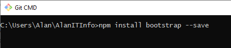
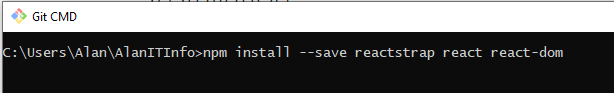
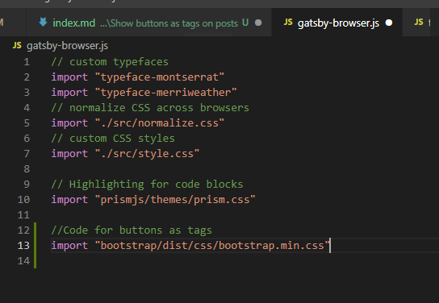
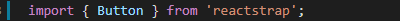
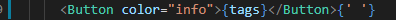
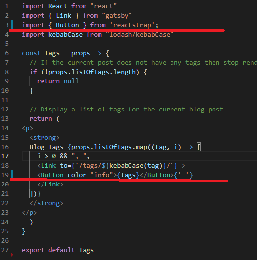
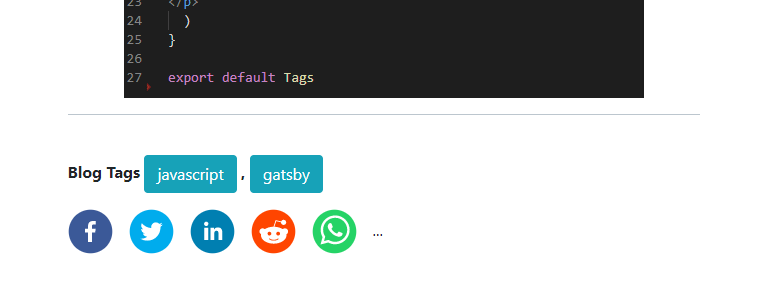

So the buttons used in this example are from reactstrap 

([https://reactstrap.github.io/](https://reactstrap.github.io/components/buttons/))

You will need to install two compoents to make them available for use in your gatbsy blog

bootstrap 

react-bootstrap

Next head over to gatsby-browser.js and put the following code in. import "bootstrap/dist/css/bootstrap.min.css"

You have now sucessfully setup bootstrap in your gatsby blog, now lets use to change tags.

Head over to src/components/tags.js and insert the following code.

and

Your tags.js should look the ones below.

And you should now have the following at the bottom of your posts

You can further modifying this by changing the tags.js file to remove the "blog tags" starter or the , between the tags if needed.

