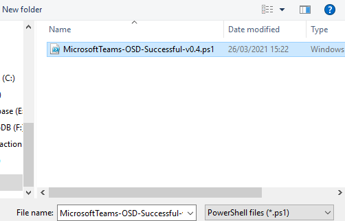
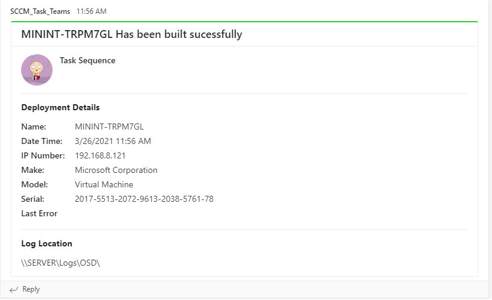

Quick blog post on how to send a notification about your Task Sequence to a teams channel, useful if you want to keep an eye on certain task sequences as a whole or just parts of the sequence.

1. Head over to msendpointmgr and get a copy of the MicrosoftTeams-OSD-Successful-v0.4.ps1 
([msendpointmgr](https://msendpointmgr.com/2017/10/06/configmgr-osd-notification-service-teams/))

2. Edit the Powershell and add your uri from teams webhook and save.
   

3. Edit the task sequence you wish to setup notifications from
    

4. Click Add - General - "Run PowerShell Script"
    

5. Click the "Enter PowerShell Script" button and click "Add Script"
    

6. Click the "Open" button 
    

7. Navigate to the location of the PowerShell Script and click Open
    

8. This has copied the the powershell script to the task sequence if need to make a edit click the edit box in bottom left hand corner and click "OK" to close the window
    

9. You will now be back at the properties window, You can now set other options such as Parameters/Output to task sequence/start in etc... for testing set the "PowerShell execution policy" to "bypass" and click "OK"
    

10. Now when you run your task sequence when the script is run you will now receive notification in teams.
    

